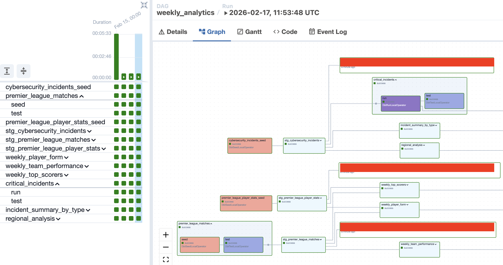

# dbt-Cosmos: Cybersecurity Analytics with Apache Airflow

Orchestration of dbt transformations using Apache Airflow and Astronomer Cosmos with Snowflake as the data warehouse.

## TO DO:

Add incident notification on dag and dbt test failures. (incident.io or PagerDuty)

## Architecture

```
┌─────────────┐      ┌─────────────┐      ┌─────────────┐
│   Airflow   │─────▶│   Cosmos    │─────▶│     dbt     │
│  Scheduler  │      │  Framework  │      │   Models    │
└─────────────┘      └─────────────┘      └─────────────┘
                                                  │
                                                  ▼
                                           ┌─────────────┐
                                           │    Data     │
                                           │  Warehouse  │
                                           │             │
                                           └─────────────┘
```

## Prerequisites

- **Docker Desktop** (recommended) or Docker CLI
- **Snowflake account** with database, warehouse, and appropriate permissions
- 5 minutes to set up

## Quick Start

### 1. Clone the Repository

```bash
git clone <your-repo-url>
cd dbt-cosmos
```

### 2. Configure Environment Variables

```bash
# Copy the example environment file
cp .env.example .env

# Generate a Fernet key
python -c "from cryptography.fernet import Fernet; print(Fernet.generate_key().decode())"
```

**Edit `.env` file** with your Snowflake credentials:

```bash
export AIRFLOW_FERNET_KEY=<paste-your-generated-fernet-key-here>

export SNOWFLAKE_ACCOUNT=your-account
export SNOWFLAKE_USER=your-username
export SNOWFLAKE_PASSWORD=your-password
export SNOWFLAKE_ROLE=ACCOUNTADMIN
export SNOWFLAKE_WAREHOUSE=your-warehouse
export SNOWFLAKE_DATABASE=CYBERSECURITY_DB
export SNOWFLAKE_SCHEMA=PUBLIC
```

### 3. Build and Start the Services

```bash
# Build the custom Airflow image with dbt
docker-compose build

# Start all containers
docker-compose up -d

# Check status (all services should be "running" or "exited" for airflow-init)
docker-compose ps

# View logs to monitor startup (optional)
docker-compose logs -f
```

**First-time startup** will take a few minutes to:
1. Build the Airflow image with dbt installed
2. Initialize the Airflow database
3. Create the admin user
4. Start the webserver and scheduler

### 4. Access Airflow

1. Open your browser to **http://localhost:8080**
2. Login with:
   - **Username**: `admin`
   - **Password**: `admin`
3. Find the `cybersecurity_analytics_dbt` DAG
4. Unpause the DAG (toggle switch) and trigger it

### 5. View dbt Test Results

When the DAG runs, you'll see **task groups** for each model:
- **Model execution** (seed/run tasks)
- **Test execution** (shown after each model completes)

You will see your dbt models rendered as Airflow dags
Models execute sequentially based on dependencies.



### dbt Tests Included
All models include comprehensive data quality tests:
- ✅ Uniqueness checks
- ✅ Not-null constraints
- ✅ Accepted values validation
- ✅ Referential integrity

## Snowflake Setup

Before running the DAG, create the necessary Snowflake resources:

```sql
-- Create database and schema
CREATE DATABASE CYBERSECURITY_DB;
CREATE SCHEMA CYBERSECURITY_DB.PUBLIC;

-- Grant permissions
GRANT USAGE ON DATABASE CYBERSECURITY_DB TO ROLE ACCOUNTADMIN;
GRANT USAGE ON SCHEMA CYBERSECURITY_DB.PUBLIC TO ROLE ACCOUNTADMIN;
GRANT CREATE TABLE ON SCHEMA CYBERSECURITY_DB.PUBLIC TO ROLE ACCOUNTADMIN;
GRANT CREATE VIEW ON SCHEMA CYBERSECURITY_DB.PUBLIC TO ROLE ACCOUNTADMIN;
```

## Troubleshooting

### Logs Not Visible in Airflow UI

**Issue**: Getting 403 errors when viewing logs
**Solution**: Ensure `AIRFLOW_FERNET_KEY` is set in your `.env` file. Generate one with:
```bash
python -c "from cryptography.fernet import Fernet; print(Fernet.generate_key().decode())"
```

### DAG Not Appearing

**Check for syntax errors:**
```bash
docker-compose exec airflow-scheduler airflow dags list
```

**View scheduler logs:**
```bash
docker-compose logs airflow-scheduler
```

### Snowflake Connection Errors

**Test dbt connection manually:**
```bash
docker-compose exec airflow-scheduler bash
cd /opt/airflow/include/dbt
dbt debug
```

This will verify that all Snowflake environment variables are set correctly.

### Database Reset

If you need to completely reset:
```bash
docker-compose down -v  # Remove all volumes
docker-compose build    # Rebuild images
docker-compose up -d    # Recreate everything fresh
```

### Tasks Failing

**View task logs in terminal:**
```bash
docker-compose exec airflow-scheduler bash
cat logs/dag_id=cybersecurity_analytics_dbt/run_id=<run_id>/task_id=<task_id>/attempt=1.log
```

## Development

### Adding New dbt Models

1. Create your `.sql` file in `include/dbt/models/`
2. Add tests in the corresponding `schema.yml`
3. Cosmos will automatically detect and add it to the DAG - no code changes needed!

### Modifying the DAG

Edit `dags/cybersecurity_analytics_dag.py` and the scheduler will automatically pick up changes.

### Using RenderConfig for Advanced Control

The DAG includes `RenderConfig` for advanced control over how dbt models are rendered in Airflow:

**Select specific models to run:**
```python
render_config = RenderConfig(
    select=["+critical_incidents"],  # Run critical_incidents and all upstream deps
)
```

**Exclude models by tag:**
```python
render_config = RenderConfig(
    exclude=["tag:deprecated"],  # Skip models tagged as deprecated
)
```

**Run only changed models (for CI/CD):**
```python
render_config = RenderConfig(
    select=["state:modified+"],  # Only run modified models and downstream
)
```

See `dags/cybersecurity_analytics_dag.py:31-44` for more configuration options.

### Running dbt Commands Manually

```bash
# Access the scheduler container
docker-compose exec airflow-scheduler bash

# Navigate to dbt project
cd /opt/airflow/include/dbt

# Run dbt commands
dbt run
dbt test
dbt docs generate
dbt docs serve
```

## Stopping the Environment

```bash
# Stop services (keeps data)
docker-compose down

# Stop and remove volumes (WARNING: deletes all data)
docker-compose down -v
```